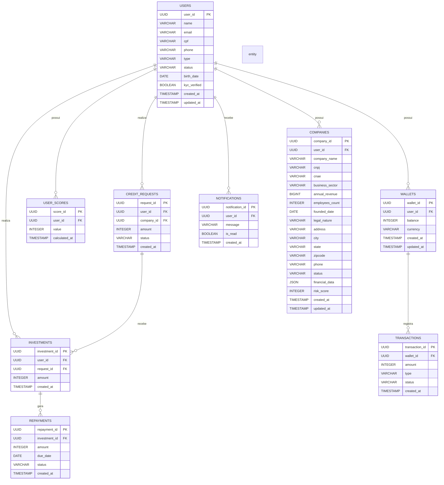

# Modelo de Projeto de Tecnologia: Solução de Investimentos P2P – Qinvest

## 1. Contexto

O Qinvest é uma plataforma de investimentos P2P (peer-to-peer) que conecta PMEs em busca de crédito a investidores que procuram maior rentabilidade. A plataforma garante simplicidade, segurança e clareza, usando a API Qi Tech como **Backend as a Service (BaaS)** para operações de Pix, crédito e liquidações. 

A Qi Tech atua como BaaS, fornecendo funcionalidades financeiras pré-construídas que permitem ao Qinvest focar em sua lógica de negócios principal (matching, score proprietário, experiência do usuário) sem desenvolver infraestrutura regulatória complexa. Isso acelera o tempo de mercado, reduz custos operacionais e garante conformidade com as regulamentações do Banco Central do Brasil.

## 2. Objetivo

O objetivo é desenvolver uma plataforma que atenda a três públicos principais:

*   **PMEs:** Permitir que solicitem crédito de forma digital, rápida e transparente.
*   **Investidores:** Oferecer a possibilidade de investir em oportunidades segmentadas por risco, setor e retorno.
*   **Plataforma:** Administrar a carteira virtual, os pagamentos, os investimentos e o matching entre as partes, com monitoramento em tempo real.

## 3. Estrutura de Banco de Dados (Supabase)

Para suportar as operações da plataforma Qinvest, propomos uma estrutura de banco de dados relacional, utilizando **Postgres gerenciado pelo Supabase**, otimizada para transações financeiras, segurança e escalabilidade. As principais entidades e seus relacionamentos são detalhados abaixo, visando a integridade dos dados e a eficiência das operações.

### Diagrama de Entidade-Relacionamento (DER)



```

## 4. Estrutura de Backend (FastAPI)

A solução de backend será desenvolvida utilizando FastAPI, proporcionando uma base sólida para um desenvolvimento escalável e de fácil manutenção. A arquitetura seguirá o padrão de microsserviços, com a organização em módulos e uma estrutura de pastas bem definida.

### Organização em Módulos

*   **/auth:** Registro/login, integração Gov.br, KYC (biometria).
*   **/wallet:** Depósitos (Pix), saques, histórico.
*   **/companies:** Cadastro e gestão de empresas (PMEs), validação de CNPJ, análise de dados empresariais.
*   **/credits:** Solicitações de crédito das PMEs.
*   **/investments:** Lista de oportunidades, aportes.
*   **/score:** Cálculo de risco e juros.
*   **/payments:** Liquidação, integração Pix via Qi Tech, webhooks.
*   **/notifications:** Alertas e feedback.
*   **/admin:** Painel administrativo.

### Detalhando as Funcionalidades BaaS da Qi Tech Utilizadas

Os serviços da Qi Tech consumidos pelo Qinvest, que se enquadram no modelo BaaS, incluem:

*   **Serviço de Pagamentos (Pix):** Geração de QR Codes, processamento de pagamentos instantâneos e recebimento de webhooks de confirmação. Isso abstrai a complexidade de integração direta com o SPB (Sistema de Pagamentos Brasileiro).
*   **Serviço de Crédito:** Geração e gestão de dívidas, liquidação de operações de crédito. A Qi Tech lida com a complexidade de registro e acompanhamento dessas operações.
*   **Serviço de Análise de Crédito (`/credit_analysis`):** Fornece uma avaliação inicial de risco para PF e PJ, agilizando o processo de scoring do Qinvest. Este serviço é um componente crucial para a precificação dinâmica de juros.
*   **Serviço de Certificação (CertifiedQI):** Para o fluxo de captação, a API CertifiedQI é utilizada para o envio e assinatura de contratos, garantindo a validade jurídica e a segurança dos acordos entre PMEs e investidores.

### Módulo de Score de Risco

#### Objetivo

Criar um sistema que calcula uma **nota de risco (0–1000)** para cada usuário (Pessoa Física ou Pessoa Jurídica), utilizada para a precificação dinâmica de juros. O sistema será inicialmente baseado em regras fixas simples, mas projetado para uma evolução futura para modelos de Machine Learning.

#### Entradas de Dados

**Pessoa Física (PF):**

*   Idade
*   Renda declarada
*   Histórico de pagamento (quando disponível)
*   Validação documental (KYC)

**Pessoa Jurídica (PJ):**

*   Faturamento
*   DRE (Demonstração de Resultado)
*   Setor de atuação (CNAE)
*   Tempo de atividade
*   Dívidas ativas (se disponível)

#### Saída

*   **Score:** Um valor inteiro entre 0 e 1000.
    *   Quanto maior o score, menor o risco e, consequentemente, menores os juros aplicados.
    *   Quanto menor o score, maior o risco e, consequentemente, maiores os juros aplicados.

#### Endpoints REST (FastAPI)

*   `POST /score`: Recebe dados de PF/PJ e salva o score calculado.
*   `GET /score/{user_id}`: Retorna o último score salvo de um usuário específico.

#### Implementação Própria de Score

**Modelo de Regras Fixas Inicial (Exemplo):**

*   PF com idade > 25 e renda > R$ 3.000: +200 pontos.
*   PJ com faturamento > R$ 500.000/ano e tempo de atividade > 2 anos: +300 pontos.
*   Penalizações serão aplicadas em caso de dívidas ativas ou baixa renda/faturamento.

**Persistência:** O score calculado será salvo na tabela `USER_SCORES` (campo `value` do tipo `INT`).

**Evolução Futura:**

*   Substituição da lógica de regras por um modelo de Machine Learning supervisionado (ex: Regressão Logística, Random Forest).
*   Treinamento do modelo com histórico de adimplência (variável alvo: pagou / não pagou).

### Estrutura de Pastas

```
📁 app/
├── 📁 api/                     ── Rotas REST (auth, wallet, credits, investments, etc.)
├── 📁 services/               ── Regras de negócio e lógica de aplicação
├── 📁 integrations/           ── APIs externas (Qi Tech, Receita Federal, biometria)
├── 📁 models/                 ── Schemas e modelos de banco
├── 📁 db/                     ── Configuração e migrações do banco
├── 📁 core/                   ── Configurações centrais (security, config)
├── 📁 tests/                  ── Testes unitários, integração e E2E
├── 📄 main.py                 ── Entrada principal FastAPI
├── 📄 requirements.txt        ── Dependências Python
├── 📄 .env.example           ── Variáveis de ambiente
└── 📄 docker-compose.yml     ── Orquestração local
```

### Justificativas das Adições

**1. API Routes (`/api/`)**
- Centraliza todas as rotas REST da aplicação
- Organiza endpoints por domínio (auth, wallet, credits, investments)
- Facilita manutenção e versionamento das APIs

**2. Regras de Negócio (`/services/`)**
- Concentra toda lógica de aplicação
- Separa regras de negócio das rotas HTTP
- Facilita testes unitários e reutilização de código

**3. Integrações Externas (`/integrations/`)**
- Abstrai comunicação com APIs de terceiros (Qi Tech, Receita Federal)
- Centraliza configurações de serviços externos
- Facilita mocking em testes e mudanças de provedores

**4. Modelos e Schemas (`/models/`)**
- Define estruturas de dados com Pydantic
- Garante validação automática de entrada/saída
- Documenta automaticamente a API com OpenAPI

**5. Configuração de Banco (`/db/`)**
- Gerencia conexões e configurações do PostgreSQL
- Organiza migrações e scripts de banco
- Centraliza queries e operações de dados

**6. Configurações Centrais (`/core/`)**
- Gerencia variáveis de ambiente e configurações globais
- Centraliza funções de segurança e autenticação
- Padroniza tratamento de erros e exceções

**7. Estrutura de Testes (`/tests/`)**
- Organiza testes unitários, integração e E2E
- Garante qualidade e confiabilidade do código
- Facilita desenvolvimento orientado por testes (TDD)

## 5. Estrutura de Frontend (React)

A aplicação frontend será desenvolvida utilizando React com Next.js e TypeScript, proporcionando uma base sólida para um desenvolvimento escalável e de fácil manutenção. A arquitetura seguirá o padrão de componentes reutilizáveis e gerenciamento de estado centralizado.

### Tecnologias Principais

*   **React + Next.js:** Framework principal para construção da interface de usuário.
*   **TypeScript:** Para tipagem estática e melhor experiência de desenvolvimento.
*   **Tailwind CSS:** Framework CSS utilitário para estilização rápida e consistente.
*   **Axios:** Para comunicação com APIs REST.
*   **Recharts:** Para visualização de dados e gráficos.

### Estrutura de Componentes

```
📁 src/
├── 📁 components/              ── Componentes React reutilizáveis
│   ├── 📁 common/              ── Componentes compartilhados
│   ├── 📁 forms/               ── Formulários da aplicação
│   └── 📁 dashboard/           ── Componentes do painel
├── 📁 pages/                   ── Páginas Next.js (roteamento)
│   └── 📁 investments/         ── Páginas de investimentos
├── 📁 hooks/                   ── Custom hooks React
├── 📁 services/                ── Cliente de API e serviços
├── 📁 types/                   ── Tipos TypeScript
└── 📁 utils/                   ── Utilitários e formatadores
```

## 6. Visão Geral da Arquitetura

Este diagrama ilustra os principais componentes da plataforma Qinvest e o fluxo de comunicação entre eles:

*   **Usuário (Investidor / PME):** Interage diretamente com o Frontend.
*   **Frontend (React/Next.js):** A interface do usuário que se comunica com o Backend.
*   **Backend (FastAPI):** O coração da aplicação, que gerencia a lógica de negócios e se conecta a outros serviços:
    *   **Serviços de Backend:** Auth, Wallet, Credit, Investment, Score, Payment, Notification.
    *   **Banco de Dados (PostgreSQL via Supabase):** Armazena todos os dados transacionais e de usuário.
    *   **APIs Externas:** Integrações com serviços de terceiros como Receita Federal (PJ), Biometria/KYC e a API Qi Tech (para Pix, Crédito e Liquidação).

## 7. Fluxo de Investimento/Crédito

Este diagrama detalha o fluxo de uma operação de investimento e crédito dentro da plataforma Qinvest.

O fluxo de investimento e crédito na plataforma Qinvest pode ser detalhado em duas etapas principais:

### Fluxo de Depósito

1.  **Investidor** inicia um depósito via Pix.
2.  O **Backend** cria uma transação correspondente.
3.  A **API Qi Tech** gera o código Pix para o depósito.
4.  Um **Webhook da Qi Tech** confirma o pagamento.
5.  O saldo do investidor é **atualizado na Carteira Virtual**.

### Fluxo de Captação

1.  PME solicita a criação de uma captação
2.  Backend solicita o envio do contrato à API CertifiedQI à PME
3.  PME assina o contrato assina o contrato
4.  Backend cria evento captação e disponibiliza na plataforma

### Fluxo de Investimento

1.  **Investidor** escolhe uma **PME** para investir e realiza um aporte.
2.  O **Backend** localiza a captação e fornece o contrato de confirmação do investimento.
3.  O **Investidor** aceita os termos.
4.  O **Backend** transfere o dinheiro investido da carteira do **Investidor** para a captação.

### Fluxo de Geração de Dívida

1.  **Investidor** completa uma captação.
2.  **Backend** fecha captação e solicita geração de dívida da **PME** à **API Qi Tech**.
3.  A **Qi Tech** retorna confirmação da geração de dívida
4.  **Backend** transfere o dinheiro da captação para a carteira virtual da **PME**
5.  **PME** recebe o crédito (processado via API Qi Tech)

### Fluxo de Pagamento de Dívida

1.  **Backend** notifica a necessidade do pagamento da dívida.
2.  **PME** acessa a plataforma e solicita o pagamento
3.  **Backend** mostra formas de pagamento
4.  **PME** seleciona forma e fornece informações
5.  A Carteira virtual do **PME** recebe o pagamento (através da **API da Qi Tech)** e é transferida automaticamente para o evento de captação.
6.  (quando dívida completa) **Backend** calcula os investimentos, juros, taxas de serviços e redistribui o pagamento para os investidores, de acordo com o preço.

## Integração do Sistema de Score (Qi Tech + Qinvest)

### Visão Geral

O Qinvest utilizará a API de Credit Analysis da Qi Tech como base para avaliação de risco de crédito de pessoas físicas (PF) e pessoas jurídicas (PJ). Essa análise será combinada com um motor de regras próprio (com possibilidade futura de machine learning) para gerar uma nota de score de 0 a 1000, usada na precificação de juros e exibição no dashboard.

### Fluxo da Integração

1.  O usuário (PF ou PJ) realiza uma solicitação de crédito no Qinvest.
2.  O backend Qinvest (FastAPI) envia os dados necessários para a API Qi Tech `/credit_analysis`:
    *   PF: CPF, dados cadastrais, renda, histórico.
    *   PJ: CNPJ, DRE, faturamento, setor.
3.  A Qi Tech retorna um status de análise:
    *   `automatically_approved`
    *   `automatically_reproved`
    *   `in_manual_analysis`
    *   `awaiting_documents`
4.  O backend Qinvest interpreta a resposta e aplica ajustes internos:
    *   Exemplo: PME em setor de alto risco recebe penalização.
    *   Exemplo: histórico interno positivo gera bônus no score.
5.  O score final (0–1000) é calculado e armazenado na tabela `users`.
6.  O score é exibido no dashboard e usado para definir a taxa de juros da operação.

### Modelo de Dados

A tabela `users` terá campo adicional:

`score INT -- nota de risco final (0–1000)`

A tabela `credit_requests` guardará o status da Qi Tech:

`qi_status VARCHAR(50) -- automatically_approved, reproved, etc.`

### Exemplo de Integração

```python
# services/score_service.py
import httpx

def calculate_score(user_data):
    response = httpx.post(
        "https://api.qitech.com/credit_analysis",
        headers={"Authorization": f"Bearer {QI_API_KEY}"},
        json=user_data
    )
    qi_result = response.json()
    base_score = {
        "automatically_approved": 800,
        "in_manual_analysis": 600,
        "automatically_reproved": 300
    }.get(qi_result["status"], 500)

    if user_data.get("faturamento", 0) > 500000:
        base_score += 100
    if user_data.get("setor") == "alto_risco":
        base_score -= 100

    return max(0, min(1000, base_score))
```

### Considerações de Segurança

*   Consentimento explícito do cliente para consulta a bureaus (SCR).
*   Criptografia de dados sensíveis em conformidade com a LGPD.
*   Logs de auditoria de cada requisição feita à Qi Tech.

## 8. Estratégia de Deploy

Para o deploy da plataforma Qinvest, adotaremos uma abordagem em duas fases, visando otimizar custos e escalabilidade de acordo com a maturidade do projeto.

### Deploy para MVP (Produto Mínimo Viável)

*   **Backend (FastAPI):** Será hospedado no **Railway**, uma plataforma de deploy que oferece facilidade de uso e integração contínua para aplicações baseadas em contêineres.
*   **Frontend (React/Next.js):** Será deployado na **Vercel**, conhecida por sua performance e otimização para aplicações Next.js, além de oferecer deploy contínuo a partir do repositório de código.
*   **Banco de Dados (Supabase):** Utilizará o serviço gerenciado **Supabase**, que oferece uma solução robusta e escalável com funcionalidades adicionais como autenticação e APIs em tempo real.

### Deploy para Escala

À medida que a plataforma Qinvest crescer e demandar maior capacidade e flexibilidade, a estratégia de deploy será migrada para provedores de nuvem mais abrangentes.

*   **Infraestrutura:** A migração será para **AWS (Amazon Web Services)** ou **GCP (Google Cloud Platform)**, que oferecem uma vasta gama de serviços para computação, banco de dados, rede e segurança, permitindo uma arquitetura de microserviços mais complexa e escalável, com balanceamento de carga, auto scaling e alta disponibilidade.

