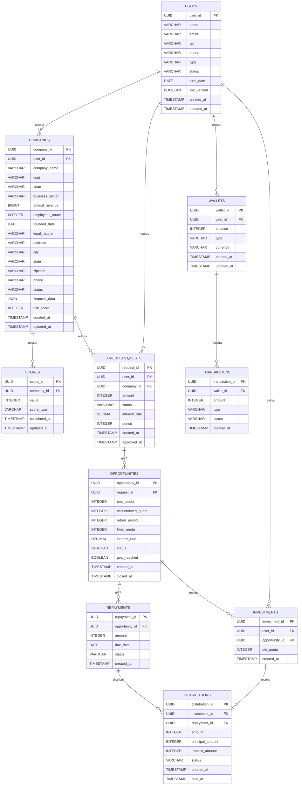

# Modelo de Projeto de Tecnologia: Solução de Investimentos P2P – Qinvest

Repositório backend: https://github.com/QInvest/qinvest-backend.git
Repositório frontend: https://github.com/QInvest/qinvest-frontend.git
Repositório api de score e análise: https://github.com/QInvest/qinvest-score.git

## 1. Contexto

O Qinvest é uma plataforma de investimentos P2P (peer-to-peer) que conecta PMEs em busca de crédito a investidores que procuram maior rentabilidade. A plataforma garante simplicidade, segurança e clareza, usando a API Qi Tech como **Backend as a Service (BaaS)** para operações de Pix, crédito e liquidações. 

A Qi Tech atua como BaaS, fornecendo funcionalidades financeiras pré-construídas que permitem ao Qinvest focar em sua lógica de negócios principal (matching, score proprietário, experiência do usuário) sem desenvolver infraestrutura regulatória complexa. Isso acelera o tempo de mercado, reduz custos operacionais e garante conformidade com as regulamentações do Banco Central do Brasil.

## 2. Objetivo

O objetivo é desenvolver uma plataforma que atenda a três públicos principais:

*   **PMEs:** Permitir que solicitem crédito de forma digital, rápida e transparente.
*   **Investidores:** Oferecer a possibilidade de investir em oportunidades segmentadas por risco, setor e retorno.
*   **Plataforma:** Administrar a carteira virtual, os pagamentos, os investimentos e o matching entre as partes, com monitoramento em tempo real.

## 3. Estrutura de Banco de Dados

Para suportar as operações da plataforma Qinvest, utilizamos uma estrutura de banco de dados híbrida que combina **SQLModel com SQLite** para desenvolvimento local e **PostgreSQL gerenciado pelo Supabase** para produção. Esta abordagem oferece flexibilidade durante o desenvolvimento e escalabilidade em produção.

### Tecnologias de Banco de Dados

*   **SQLModel:** ORM moderno baseado no SQLAlchemy, utilizado para modelagem de dados e migrações.
*   **SQLite:** Banco de dados leve e rápido para desenvolvimento e testes locais.
*   **Supabase:** Plataforma Backend-as-a-Service com PostgreSQL para produção, oferecendo autenticação integrada, APIs em tempo real e painel administrativo.

### Configuração de Desenvolvimento

O projeto utiliza SQLModel para definir modelos de dados Python que são automaticamente sincronizados com o banco SQLite:

```python
# Exemplo de modelo SQLModel (app/models/)
from sqlmodel import SQLModel, Field
from typing import Optional
from datetime import datetime

class User(SQLModel, table=True):
    id: Optional[int] = Field(default=None, primary_key=True)
    name: str
    email: str = Field(unique=True, index=True)
    created_at: datetime = Field(default_factory=datetime.utcnow)
```

### Configuração de Produção (Supabase)

Em produção, os dados são armazenados no PostgreSQL do Supabase com as seguintes características:

*   **Autenticação integrada:** Gestão de usuários e sessões via Supabase Auth
*   **APIs em tempo real:** Sincronização automática de dados entre clientes
*   **Backup automático:** Segurança e recuperação de dados
*   **Escalabilidade:** Recursos sob demanda conforme o crescimento da plataforma

### Diagrama de Entidade-Relacionamento (DER)



## 4. Estrutura de Backend (FastAPI)

A solução de backend será desenvolvida utilizando FastAPI, proporcionando uma base sólida para um desenvolvimento escalável e de fácil manutenção. A arquitetura seguirá o padrão de microsserviços, com a organização em módulos e uma estrutura de pastas bem definida.

### Organização em Módulos

*   **/auth:** Registro/login, integração Gov.br, KYC (biometria).
*   **/wallet:** Depósitos (Pix), saques, histórico.
*   **/companies:** Cadastro e gestão de empresas (PMEs), validação de CNPJ, análise de dados empresariais.
*   **/credits:** Solicitações de crédito das PMEs.
*   **/investments:** Lista de oportunidades, aportes.
*   **/score:** Cálculo de risco de PMEs solicitantes e precificação de juros.
*   **/payments:** Liquidação, integração Pix via Qi Tech, webhooks.
*   **/admin:** Painel administrativo.

### Detalhando as Funcionalidades BaaS da Qi Tech Utilizadas

Os serviços da Qi Tech consumidos pelo Qinvest, que se enquadram no modelo BaaS, incluem:

*   **Serviço de Pagamentos (Pix):** Geração de QR Codes, processamento de pagamentos instantâneos e recebimento de webhooks de confirmação. Isso abstrai a complexidade de integração direta com o SPB (Sistema de Pagamentos Brasileiro).
*   **Serviço de Crédito:** Geração e gestão de dívidas, liquidação de operações de crédito. A Qi Tech lida com a complexidade de registro e acompanhamento dessas operações.
*   **Serviço de Análise de Crédito (`/credit_analysis`):** Fornece uma avaliação inicial de risco para PF e PJ, agilizando o processo de scoring do Qinvest. Este serviço é um componente crucial para a precificação dinâmica de juros.
*   **Serviço de Certificação (CertifiedQI):** Para o fluxo de captação, a API CertifiedQI é utilizada para o envio e assinatura de contratos, garantindo a validade jurídica e a segurança dos acordos entre PMEs e investidores.

### Módulo de Score de Risco

#### Objetivo

Criar um sistema que calcula uma **nota de risco (0–1000)** para **PMEs e empresários que desejam solicitar crédito** (colocar sua empresa/projeto à venda para captação de recursos). O score é utilizado para a precificação dinâmica de juros oferecidos aos investidores. O sistema será inicialmente baseado em regras fixas simples, mas projetado para uma evolução futura para modelos de Machine Learning.

#### Entradas de Dados

**Pessoa Física Empresária (PF) - Solicitante de Crédito:**

*   Idade
*   Renda declarada
*   Histórico de pagamento (quando disponível)
*   Validação documental (KYC)

**Pessoa Jurídica (PJ) - PME Solicitante de Crédito:**

*   Faturamento
*   DRE (Demonstração de Resultado)
*   Setor de atuação (CNAE)
*   Tempo de atividade
*   Dívidas ativas (se disponível)

#### Saída

*   **Score:** Um valor inteiro entre 0 e 1000.
    *   Quanto maior o score, menor o risco e, consequentemente, menores os juros aplicados.
    *   Quanto menor o score, maior o risco e, consequentemente, maiores os juros aplicados.

#### Endpoints REST (FastAPI)

*   `POST /score`: Recebe dados de PF/PJ solicitantes de crédito e salva o score calculado.
*   `GET /score/{user_id}`: Retorna o último score salvo de um solicitante de crédito específico.

#### Implementação Própria de Score

**Modelo de Regras Fixas Inicial (Exemplo):**

*Score Base: 500 pontos*

**Bonificações por Perfil Empresarial:**
*   Startup/PME com faturamento anual entre R$ 120K - R$ 1.2M e tempo > 1 ano: +120 pontos
*   PME consolidada com faturamento > R$ 1.2M/ano e tempo > 3 anos: +200 pontos
*   Setor de baixo risco (tecnologia, saúde, educação): +80 pontos
*   Margem EBITDA > 10%: +100 pontos
*   Histórico de pontualidade fiscal (sem pendências na Receita): +60 pontos
*   Produto/serviço com recorrência comprovada: +70 pontos

**Bonificações para PF Empresária:**
*   Idade entre 25-50 anos e renda comprovada > R$ 4.000: +80 pontos
*   Experiência no setor > 2 anos: +60 pontos
*   Score positivo no SPC/Serasa: +50 pontos
*   Formação superior relacionada ao negócio: +40 pontos

**Penalizações:**
*   Setor de alto risco (restaurantes, eventos, turismo): -120 pontos
*   Dívidas ativas > R$ 15.000: -150 pontos
*   Faturamento decrescente nos últimos 12 meses: -80 pontos
*   Margem EBITDA negativa: -140 pontos
*   Empresa com menos de 6 meses: -180 pontos
*   Modelo de negócio não comprovado/MVP: -60 pontos

**Persistência:** O score calculado será salvo na tabela `SCORES` (campo `value` do tipo `INT`), associado tanto ao usuário quanto à empresa quando aplicável.

**Evolução Futura:**

*   Substituição da lógica de regras por um modelo de Machine Learning supervisionado (ex: Regressão Logística, Random Forest).
*   Treinamento do modelo com histórico de adimplência (variável alvo: pagou / não pagou).

### Estrutura de Pastas

```
📁 qinvest-backend/
├── 📁 app/                           ── Código principal da aplicação
│   ├── 📁 api/                       ── Módulos das APIs organizados por domínio
│   │   ├── 📁 admin/                 ── Funcionalidades administrativas
│   │   ├── 📁 auth/                  ── Autenticação e autorização
│   │   │   ├── 📄 app.py            ── Configuração do módulo auth
│   │   │   ├── 📄 models.py          ── Modelos de dados do auth
│   │   │   ├── 📄 paths.py           ── Definição das rotas auth
│   │   │   ├── 📄 supabase_auth.py   ── Integração com Supabase Auth
│   │   │   └── 📄 views.py           ── Views e handlers do auth
│   │   └── 📁 wallet/                ── Gestão de carteiras e transações
│   ├── 📁 core/                      ── Configurações centrais
│   │   ├── 📄 config.py              ── Configurações da aplicação
│   │   └── 📄 cors_middleware.py     ── Middleware CORS
│   ├── 📁 db/                        ── Configuração e migrações do banco
│   │   ├── 📄 database.py            ── Conexão com banco de dados
│   │   ├── 📄 init_db.py             ── Inicialização do banco
│   │   └── 📄 sqlmodel_db.py         ── Configuração SQLModel
│   ├── 📁 integrations/              ── Integrações com APIs externas
│   │   ├── 📄 app.py                 ── Configuração do módulo
│   │   ├── 📄 models.py              ── Modelos das integrações
│   │   ├── 📄 paths.py               ── Rotas das integrações
│   │   └── 📄 views.py               ── Views das integrações
│   ├── 📁 models/                    ── Schemas e modelos de dados
│   ├── 📁 services/                  ── Regras de negócio
│   └── 📁 __pycache__/               ── Arquivos compilados Python
├── 📁 scripts/                       ── Scripts utilitários
│   ├── 📄 create_user.py             ── Criação de usuários
│   └── 📄 login.py                   ── Script de login
├── 📁 tests/                         ── Testes automatizados
│   └── 📄 test_auth.py               ── Testes de autenticação
├── 📄 main.py                        ── Ponto de entrada da aplicação
├── 📄 requirements.txt               ── Dependências Python
├── 📄 Dockerfile                     ── Configuração para containerização
├── 📄 README.md                      ── Documentação específica do backend
└── 📄 test.db                        ── Banco de dados SQLite para testes
```

### Justificativas das Adições

**1. API Routes (`/api/`)**
- Centraliza todas as rotas REST da aplicação
- Organiza endpoints por domínio (auth, wallet, credits, investments)
- Facilita manutenção e versionamento das APIs

**2. Regras de Negócio (`/services/`)**
- Concentra toda lógica de aplicação
- Separa regras de negócio das rotas HTTP
- Facilita testes unitários e reutilização de código

**3. Integrações Externas (`/integrations/`)**
- Abstrai comunicação com APIs de terceiros (Qi Tech, Receita Federal)
- Centraliza configurações de serviços externos
- Facilita mocking em testes e mudanças de provedores

**4. Modelos e Schemas (`/models/`)**
- Define estruturas de dados com Pydantic
- Garante validação automática de entrada/saída
- Documenta automaticamente a API com OpenAPI

**5. Configuração de Banco (`/db/`)**
- Gerencia conexões e configurações do PostgreSQL
- Organiza migrações e scripts de banco
- Centraliza queries e operações de dados

**6. Configurações Centrais (`/core/`)**
- Gerencia variáveis de ambiente e configurações globais
- Centraliza funções de segurança e autenticação
- Padroniza tratamento de erros e exceções

**7. Estrutura de Testes (`/tests/`)**
- Organiza testes unitários, integração e E2E
- Garante qualidade e confiabilidade do código
- Facilita desenvolvimento orientado por testes (TDD)

## 5. Estrutura de Frontend (React)

A aplicação frontend será desenvolvida utilizando React com Next.js e TypeScript, proporcionando uma base sólida para um desenvolvimento escalável e de fácil manutenção. A arquitetura seguirá o padrão de componentes reutilizáveis e gerenciamento de estado centralizado.

### Tecnologias Principais

*   **React + Vite:** Framework principal para construção da interface de usuário com build tool moderno.
*   **TypeScript:** Para tipagem estática e melhor experiência de desenvolvimento.
*   **Tailwind CSS:** Framework CSS utilitário para estilização rápida e consistente.
*   **shadcn/ui:** Biblioteca de componentes UI reutilizáveis e acessíveis.
*   **React Router:** Para gerenciamento de rotas single-page application.
*   **Axios:** Para comunicação com APIs REST.
*   **Recharts:** Para visualização de dados e gráficos.

### Estrutura de Componentes

```
📁 qinvest-frontend/
├── 📁 src/                           ── Código fonte da aplicação
│   ├── 📁 components/                ── Componentes React reutilizáveis
│   │   ├── 📁 auth/                  ── Componentes de autenticação
│   │   │   └── 📄 ProtectedRoute.tsx ── Rota protegida por autenticação
│   │   ├── 📁 company/               ── Componentes relacionados a empresas
│   │   │   ├── 📄 AddCompanyDialog.tsx
│   │   │   └── 📄 [outros componentes de empresa]
│   │   ├── 📁 investment/            ── Componentes de investimentos
│   │   │   ├── 📄 AddOpportunityDialog.tsx
│   │   │   ├── 📄 CardInvestimento.tsx
│   │   │   ├── 📄 CardOportunidade.tsx
│   │   │   ├── 📄 FiltersPanel.tsx
│   │   │   ├── 📄 GraphBar.tsx
│   │   │   ├── 📄 InvestmentDialog.tsx
│   │   │   ├── 📄 SearchBar.tsx
│   │   │   └── 📄 WalletSummary.tsx
│   │   ├── 📁 layout/                ── Componentes de layout
│   │   │   ├── 📄 DashboardLayout.tsx
│   │   │   ├── 📄 footer.tsx
│   │   │   └── 📄 header.tsx
│   │   └── 📁 ui/                    ── Componentes base da UI (shadcn/ui)
│   │       ├── 📄 [múltiplos componentes básicos]
│   │       └── 📄 [button, card, dialog, etc.]
│   ├── 📁 contexts/                  ── Contextos React para estado global
│   │   ├── 📄 AuthContext.tsx        ── Gerenciamento de autenticação
│   │   └── 📄 CompanyContext.tsx     ── Gerenciamento de dados de empresa
│   ├── 📁 data/                      ── Dados mock e constantes
│   │   └── 📄 mockData.ts            ── Dados de exemplo para desenvolvimento
│   ├── 📁 hooks/                     ── Custom hooks React
│   │   ├── 📄 use-mobile.tsx         ── Hook para detectar dispositivos móveis
│   │   ├── 📄 use-toast.ts           ── Hook para notificações toast
│   │   └── 📄 useWallet.ts           ── Hook para gerenciamento de carteira
│   ├── 📁 lib/                       ── Utilitários e configurações
│   │   └── 📄 utils.ts               ── Funções utilitárias gerais
│   ├── 📁 pages/                     ── Páginas da aplicação
│   │   ├── 📄 CompanyDetail.tsx      ── Detalhes da empresa
│   │   ├── 📄 CreditRequest.tsx      ── Solicitação de crédito
│   │   ├── 📄 Dashboard.tsx          ── Dashboard principal
│   │   ├── 📄 Index.tsx              ── Página inicial
│   │   ├── 📄 Landing.tsx            ── Landing page
│   │   ├── 📄 Login.tsx              ── Página de login
│   │   ├── 📄 MeusInvestimentos.tsx  ── Lista de investimentos do usuário
│   │   ├── 📄 MinhaEmpresa.tsx       ── Gestão da empresa do usuário
│   │   ├── 📄 NotFound.tsx           ── Página 404
│   │   ├── 📄 Opportunities.tsx      ── Oportunidades de investimento
│   │   ├── 📄 Register.tsx           ── Página de cadastro
│   │   ├── 📄 Settings.tsx           ── Configurações do usuário
│   │   └── 📄 Wallet.tsx             ── Carteira digital
│   ├── 📁 services/                  ── Cliente de API e serviços
│   │   ├── 📄 api.ts                 ── Configuração da API
│   │   └── 📄 wallets.ts             ── Serviços relacionados à carteira
│   ├── 📄 App.tsx                    ── Componente principal da aplicação
│   ├── 📄 App.css                    ── Estilos globais da aplicação
│   └── 📄 main.tsx                   ── Ponto de entrada da aplicação
├── 📁 public/                        ── Arquivos estáticos públicos
│   ├── 📄 placeholder.svg            ── Imagem placeholder
│   └── 📄 robots.txt                 ── Arquivo robots.txt
├── 📁 node_modules/                  ── Dependências instaladas
├── 📄 package.json                   ── Configurações e dependências
├── 📄 vite.config.ts                 ── Configuração do Vite
├── 📄 tailwind.config.ts             ── Configuração do Tailwind CSS
├── 📄 tsconfig.json                  ── Configuração do TypeScript
├── 📄 eslint.config.js               ── Configuração do ESLint
└── 📄 index.html                     ── Arquivo HTML principal
```

## 6. Visão Geral da Arquitetura

Este diagrama ilustra os principais componentes da plataforma Qinvest e o fluxo de comunicação entre eles:

*   **Usuário (Investidor / PME):** Interage diretamente com o Frontend.
*   **Frontend (React/Next.js):** A interface do usuário que se comunica com o Backend.
*   **Backend (FastAPI):** O coração da aplicação, que gerencia a lógica de negócios e se conecta a outros serviços:
    *   **Serviços de Backend:** Auth, Wallet, Credit, Investment, Score, Payment.
    *   **Banco de Dados (PostgreSQL via Supabase):** Armazena todos os dados transacionais e de usuário.
    *   **APIs Externas:** Integrações com serviços de terceiros como Receita Federal (PJ), Biometria/KYC e a API Qi Tech (para Pix, Crédito e Liquidação).

## 7. Fluxo de Investimento/Crédito

Este diagrama detalha o fluxo de uma operação de investimento e crédito dentro da plataforma Qinvest.

O fluxo de investimento e crédito na plataforma Qinvest pode ser detalhado em duas etapas principais:

### Fluxo de Depósito

1.  **Investidor** inicia um depósito via Pix.
2.  O **Backend** cria uma transação correspondente.
3.  A **API Qi Tech** gera o código Pix para o depósito.
4.  Um **Webhook da Qi Tech** confirma o pagamento.
5.  O saldo do investidor é **atualizado na Carteira Virtual**.

### Fluxo de Captação

1.  **PME** solicita a criação de uma captação
2.  **Backend** solicita o envio do contrato à **API CertifiedQI** à **PME**
3.  **PME** assina o contrato
4.  **Backend** cria evento captação e disponibiliza na plataforma

### Fluxo de Investimento

1.  **Investidor** escolhe uma **PME** para investir e realiza um aporte.
2.  O **Backend** localiza a captação e fornece o contrato de confirmação do investimento.
3.  O **Investidor** aceita os termos.
4.  O **Backend** transfere o dinheiro investido da carteira do **Investidor** para a captação.

### Fluxo de Geração de Dívida

1.  **Investidor** completa uma captação.
2.  **Backend** fecha captação e solicita geração de dívida da **PME** à **API Qi Tech**.
3.  A **Qi Tech** retorna confirmação da geração de dívida
4.  **Backend** transfere o dinheiro da captação para a carteira virtual da **PME**
5.  **PME** recebe o crédito (processado via API Qi Tech)

### Fluxo de Pagamento de Dívida

1.  **Backend** notifica a necessidade do pagamento da dívida.
2.  **PME** acessa a plataforma e solicita o pagamento
3.  **Backend** mostra formas de pagamento
4.  **PME** seleciona forma e fornece informações
5.  A Carteira virtual do **PME** recebe o pagamento (através da **API da Qi Tech)** e é transferida automaticamente para o evento de captação.
6.  (quando dívida completa) **Backend** calcula os investimentos, juros, taxas de serviços e redistribui o pagamento para os investidores, de acordo com o preço.

## Integração do Sistema de Score (Qi Tech + Qinvest)

### Visão Geral

O Qinvest utilizará a API de Credit Analysis da Qi Tech como base para avaliação de risco de crédito de **PMEs e empresários que solicitam captação de recursos** (pessoas físicas empresárias e pessoas jurídicas). Essa análise será combinada com um motor de regras próprio (com possibilidade futura de machine learning) para gerar uma nota de score de 0 a 1000, usada na precificação de juros oferecidos aos investidores e exibição no dashboard.

### Fluxo da Integração

1.  A **PME ou empresário** realiza uma solicitação de crédito/captação no Qinvest.
2.  O backend Qinvest (FastAPI) envia os dados necessários para a API Qi Tech `/credit_analysis`:
    *   PF empresária: CPF, dados cadastrais, renda, histórico.
    *   PME (PJ): CNPJ, DRE, faturamento, setor.
3.  A Qi Tech retorna um status de análise:
    *   `automatically_approved`
    *   `automatically_reproved`
    *   `in_manual_analysis`
    *   `awaiting_documents`
4.  O backend Qinvest interpreta a resposta e aplica ajustes internos:
    *   Exemplo: PME em setor de alto risco recebe penalização.
    *   Exemplo: histórico interno positivo da empresa gera bônus no score.
5.  O score final (0–1000) é calculado e armazenado na tabela `SCORES`.
6.  O score é exibido no dashboard e usado para definir a taxa de juros da operação de captação.

### Modelo de Dados

A tabela `SCORES` armazenará os scores calculados:

```sql
SCORES (
    score_id UUID PRIMARY KEY,
    user_id UUID FOREIGN KEY REFERENCES USERS(user_id),
    company_id UUID FOREIGN KEY REFERENCES COMPANIES(company_id),
    value INT, -- nota de risco final (0–1000)
    score_type VARCHAR(50), -- 'credit_request', 'company_analysis', etc.
    calculated_at TIMESTAMP,
    updated_at TIMESTAMP
)
```

A tabela `credit_requests` guardará o status da Qi Tech:

`qi_status VARCHAR(50) -- automatically_approved, reproved, etc.`

### Exemplo de Integração

```python
# services/score_service.py
import httpx

def calculate_score(user_data):
    response = httpx.post(
        "https://api.qitech.com/credit_analysis",
        headers={"Authorization": f"Bearer {QI_API_KEY}"},
        json=user_data
    )
    qi_result = response.json()
    base_score = {
        "automatically_approved": 800,
        "in_manual_analysis": 600,
        "automatically_reproved": 300
    }.get(qi_result["status"], 500)

    if user_data.get("faturamento", 0) > 500000:
        base_score += 100
    if user_data.get("setor") == "alto_risco":
        base_score -= 100

    return max(0, min(1000, base_score))
```

### Considerações de Segurança

*   Consentimento explícito do cliente para consulta a bureaus (SCR).
*   Criptografia de dados sensíveis em conformidade com a LGPD.
*   Logs de auditoria de cada requisição feita à Qi Tech.

## 8. Estratégia de Deploy e Ferramentas de Desenvolvimento

### Deploy (Escalável já no mvp)

*   **Backend (FastAPI):** Hospedado no **Google Cloud Run**, oferecendo facilidade de uso, integração contínua e escalabilidade automática baseada em contêineres Docker.
*   **Frontend (React/Vite):** Deployado na **Vercel**, plataforma otimizada para aplicações React/Vite com deploy contínuo, CDN global e excelente performance.
*   **Banco de Dados (Supabase):** Utiliza PostgreSQL gerenciado pelo **Supabase**, oferecendo autenticação integrada, APIs em tempo real, backup automático e painel administrativo.

### Ferramentas de Desenvolvimento

*   **Backend:**
    *   **FastAPI:** Framework web moderno e rápido para construção de APIs
    *   **SQLModel:** ORM para modelagem de dados e migrações automáticas
    *   **Docker:** Containerização para ambientes consistentes
    *   **Supabase:** Banco de dados com várias integrações

*   **Frontend:**
    *   **Vite:** Build tool rápido e moderno para desenvolvimento
    *   **React 18:** Biblioteca para construção de interfaces de usuário
    *   **TypeScript:** Tipagem estática para maior confiabilidade
    *   **Tailwind CSS:** Framework CSS utilitário para estilização
    *   **shadcn/ui:** Componentes UI reutilizáveis e acessíveis
    *   **ESLint:** Linting para qualidade de código

*   **Ferramentas Comuns:**
    *   **Git:** Controle de versão distribuído
    *   **Visual Studio Code/Cursor:** IDE para desenvolvimento
    *   **Postman:** Testes e documentação de APIs
    *   **Lovable:** Assistente de IA para geração de código, documentação e automação de tarefas repetitivas.
    *   **GitHub Copilot:** Ferramenta de autocompletar código baseada em IA, acelerando o desenvolvimento e sugerindo soluções inteligentes.


